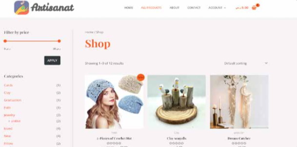

Artisanat - Craft Something Beautiful.

E-commerece course project at Qassim University.
  
## About the project
Building Artisanat Website - a platform that encourages and provides opportunities for artisans to market and sell their product via the internet and faciliates the process of reaching customers.

* Home page
  
   

* Shop page
  
   
  

* Viwe cart page
  
 

### Built With

